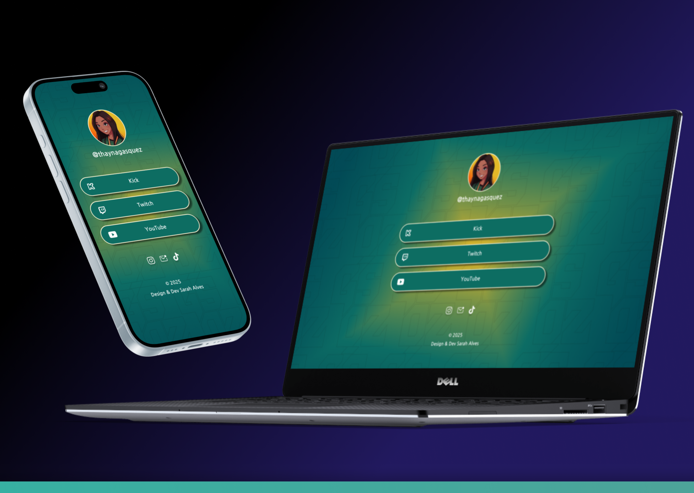

<h1 align="justify">Social Links Page</h1>

Desenvolvi uma Social Links Page personalizada para uma streamer de jogos, com o objetivo de reunir suas principais redes e canais de contato em um único espaço visualmente coerente com sua identidade.
 

O projeto foi planejado desde o protótipo no Figma até o desenvolvimento, utilizando HTML, CSS e um pouco de JavaScript para criar interações suaves e responsivas.

A paleta de cores foi mantida conforme o design já utilizado nas transmissões da cliente, garantindo consistência visual e reforço da marca pessoal.

O projeto foi hospedado e indexado no GitHub, e contará com um link personalizado para uso nas plataformas da streamer.

## 🧩 1. Design

## 🚀 2. Linguagens

## 🌐 3. Versionamento

© 2025 Design & Dev | Sarah Alves
